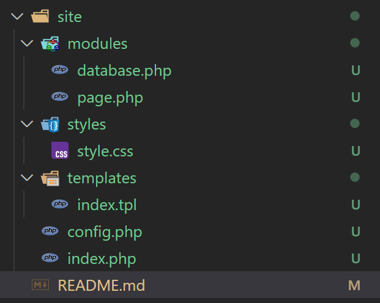

# Лабораторная работа №8. Непрерывная интеграция с помощью Github Actions
## Студент
**Gachayev Dmitrii I2302**  
**Выполнено 19.04.2025**  
## Цель работы
В рамках данной работы студенты научатся настраивать непрерывную интеграцию с помощью Github Actions.
## Задание
Создать Web приложение, написать тесты для него и настроить непрерывную интеграцию с помощью Github Actions на базе контейнеров.
## Выполнение
## Создание Web приложения
1. Создаю следующую структуру:



2. Реализую файл `modules/database.php` отталкиваясь от условий:

Файл `modules/database.php` содержит класс `Database` для работы с базой данных. Для работы с базой данных используйте `SQLite`. Класс должен содержать методы:

- `__construct($path)` - конструктор класса, принимает путь к файлу базы данных SQLite;
- `Execute($sql)` - выполняет SQL запрос;
- `Fetch($sql)` - выполняет SQL запрос и возвращает результат в виде ассоциативного массива.
- `Create($table, $data)` - создает запись в таблице $table с данными из ассоциативного массива $data и возвращает идентификатор созданной записи;
- `Read($table, $id)` - возвращает запись из таблицы $table по идентификатору $id;
- `Update($table, $id, $data)` - обновляет запись в таблице $table по идентификатору $id данными из ассоциативного массива $data;
- `Delete($table, $id)` - удаляет запись из таблицы $table по идентификатору $id.
- `Count($table)` - возвращает количество записей в таблице $table.

Итоговый файл (с документацией `PHPdoc`):
```php
<?php

class Database
{
    private PDO $pdo;

    /**
     * Конструктор класса.
     * @param string $path Путь к файлу базы данных SQLite.
     */
    public function __construct(string $path)
    {
        $this->pdo = new PDO("sqlite:" . $path);
        $this->pdo->setAttribute(PDO::ATTR_ERRMODE, PDO::ERRMODE_EXCEPTION);
    }

    /**
     * Выполняет SQL-запрос (без получения результата).
     * @param string $sql SQL-запрос.
     */
    public function Execute(string $sql): void
    {
        $this->pdo->exec($sql);
    }

    /**
     * Выполняет SQL-запрос и возвращает результат в виде массива.
     * @param string $sql SQL-запрос.
     * @return array Ассоциативный массив с результатом.
     */
    public function Fetch(string $sql): array
    {
        $stmt = $this->pdo->query($sql);
        return $stmt->fetchAll(PDO::FETCH_ASSOC);
    }

    /**
     * Создаёт запись в таблице.
     * @param string $table Название таблицы.
     * @param array $data Ассоциативный массив данных.
     * @return int ID новой записи.
     */
    public function Create(string $table, array $data): int
    {
        $columns = implode(', ', array_keys($data));
        $placeholders = ':' . implode(', :', array_keys($data));
        $sql = "INSERT INTO $table ($columns) VALUES ($placeholders)";
        $stmt = $this->pdo->prepare($sql);
        $stmt->execute($data);
        return (int)$this->pdo->lastInsertId();
    }

    /**
     * Читает запись из таблицы по ID.
     * @param string $table Название таблицы.
     * @param int $id Идентификатор записи.
     * @return array|null Ассоциативный массив данных или null, если не найдено.
     */
    public function Read(string $table, int $id): ?array
    {
        $sql = "SELECT * FROM $table WHERE id = :id";
        $stmt = $this->pdo->prepare($sql);
        $stmt->execute(['id' => $id]);
        $result = $stmt->fetch(PDO::FETCH_ASSOC);
        return $result ?: null;
    }

    /**
     * Обновляет запись в таблице.
     * @param string $table Название таблицы.
     * @param int $id Идентификатор записи.
     * @param array $data Ассоциативный массив новых данных.
     */
    public function Update(string $table, int $id, array $data): void
    {
        $fields = implode(', ', array_map(fn($k) => "$k = :$k", array_keys($data)));
        $data['id'] = $id;
        $sql = "UPDATE $table SET $fields WHERE id = :id";
        $stmt = $this->pdo->prepare($sql);
        $stmt->execute($data);
    }

    /**
     * Удаляет запись по ID.
     * @param string $table Название таблицы.
     * @param int $id Идентификатор записи.
     */
    public function Delete(string $table, int $id): void
    {
        $sql = "DELETE FROM $table WHERE id = :id";
        $stmt = $this->pdo->prepare($sql);
        $stmt->execute(['id' => $id]);
    }

    /**
     * Возвращает количество записей в таблице.
     * @param string $table Название таблицы.
     * @return int Количество записей.
     */
    public function Count(string $table): int
    {
        $sql = "SELECT COUNT(*) FROM $table";
        $stmt = $this->pdo->query($sql);
        return (int)$stmt->fetchColumn();
    }
}
```

3. Реализую файл `modules/page.php` исходя из условий:

Файл `modules/page.php` содержит класс `Page` для работы с страницами. Класс должен содержать методы:

- `__construct($template)` - конструктор класса, принимает путь к шаблону страницы;
- `Render($data)` - отображает страницу, подставляя в шаблон данные из ассоциативного массива $data.

Итоговый файл (c документацией `PHPdoc`):

```php
<?php
class Page
{
    private string $template;

    /**
     * Конструктор класса.
     * @param string $template Путь к файлу шаблона (.tpl).
     */
    public function __construct(string $template)
    {
        $this->template = $template;
    }

    /**
     * Подставляет данные в шаблон и возвращает HTML-строку.
     * @param array $data Ассоциативный массив с данными.
     * @return string HTML-код страницы.
     */
    public function Render(array $data): string
    {
        $template = file_get_contents($this->template);

        foreach ($data as $key => $value) {
            $template = str_replace('{{' . $key . '}}', htmlspecialchars($value), $template);
        }
        return $template;
    }
}
```

4. Реализую файл `templates/index.tpl` содержащий шаблон страницы:
```html
<!DOCTYPE html>
<html lang="ru">
<head>
    <meta charset="UTF-8">
    <title>{{title}}</title>
    <link rel="stylesheet" href="/styles/style.css">
</head>
<body>
    <h1>{{title}}</h1>
    <div class="content">
        {{content}}
    </div>
</body>
</html>
```

5. Реализую файл `styles/style.css` содержащий стили страницы:
```css
body {
    font-family: Arial, sans-serif;
    margin: 40px;
    background-color: #f9f9f9;
}

h1 {
    color: #333;
}

.content {
    padding: 10px;
    background-color: #fff;
    border: 1px solid #ccc;
}
```

6. Реализую файл `index.php` с кодом для отображения:
```php
<?php

require_once __DIR__ . '/modules/database.php';
require_once __DIR__ . '/modules/page.php';
require_once __DIR__ . '/config.php';

$db = new Database($config["db"]["path"]);

$page = new Page(__DIR__ . '/templates/index.tpl');

$pageId = $_GET['page'];

$data = $db->Read("page", $pageId);
echo $page->Render($data);
```

7. Реализую файл `config.php` с конфигурацией подключения к бд:

```php
<?php

$config = [
    "db" => [
        "path" => __DIR__ . "/../sql/schema.sql"
    ]
];

```

## Подготовка SQL файла для базы данных
1. Создаю в корневом каталоге директорию `/sql`.

2. Создаю файл `schema.sql` со следующим содержимым:
```sql
CREATE TABLE page (
    id INTEGER PRIMARY KEY AUTOINCREMENT,
    title TEXT,
    content TEXT
);

INSERT INTO page (title, content) VALUES ('Page 1', 'Content 1');
INSERT INTO page (title, content) VALUES ('Page 2', 'Content 2');
INSERT INTO page (title, content) VALUES ('Page 3', 'Content 3');
```

## Создание тестов
1. Создаю в корневом каталоге директорию `/tests`

2. Создаю файл `testframework.php` со следующим содержимым:
```php
<?php

function message($type, $message) {
    $time = date('Y-m-d H:i:s');
    echo "{$time} [{$type}] {$message}" . PHP_EOL;
}

function info($message) {
    message('INFO', $message);
}

function error($message) {
    message('ERROR', $message);
}

function assertExpression($expression, $pass = 'Pass', $fail = 'Fail'): bool {
    if ($expression) {
        info($pass);
        return true;
    }
    error($fail);
    return false;
}

class TestFramework {
    private $tests = [];
    private $success = 0;

    public function add($name, $test) {
        $this->tests[$name] = $test;
    }

    public function run() {
        foreach ($this->tests as $name => $test) {
            info("Running test {$name}");
            if ($test()) {
                $this->success++;
            }
            info("End test {$name}");
        }
    }

    public function getResult() {
        return "{$this->success} / " . count($this->tests);
    }
}
```

3. Создаю файл `tests.php` со следующим содержимым:
```php
<?php

require_once __DIR__ . '/testframework.php';

require_once __DIR__ . '/../config.php';
require_once __DIR__ . '/../modules/database.php';
require_once __DIR__ . '/../modules/page.php';

$testFramework = new TestFramework();

// test 1: check database connection
function testDbConnection() {
    global $config;
    // ...
}

// test 2: test count method
function testDbCount() {
    global $config;
    // ...
}

// test 3: test create method
function testDbCreate() {
    global $config;
    // ...
}

// test 4: test read method
function testDbRead() {
    global $config;
    // ...
}

// add tests
$tests->add('Database connection', 'testDbConnection');
$tests->add('table count', 'testDbCount');
$tests->add('data create', 'testDbCreate');
// ...

// run tests
$tests->run();

echo $tests->getResult();
```